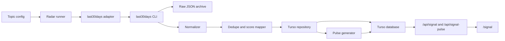

# Radar 2.0 Design

Date: 2026-06-14
Status: Design approved for spec writing, pending user review before implementation planning
Owner: Aaron Guo

## Summary

Radar 2.0 replaces the old, currently non-running Radar ingestion system with a repo-owned information integration pipeline powered by `last30days`. It keeps the blog and Signal/Radar separate:

- Blog posts remain authored essays, not automated information dumps.
- Radar 2.0 regularly researches configured topics, normalizes the output, stores structured items in Turso, and produces a daily pulse.
- `/signal` remains the public browsing surface for the information layer.
- RSS and Nuxt Content blog collections remain untouched by automated Radar output.

The recommended implementation path is a maintainable middle layer: keep the existing `/signal` user experience, replace the missing ingestion path with a tested `scripts/radar` pipeline, and schedule that pipeline through GitHub Actions or a local runner.

## Current Project Context

The repo already has a working Signal read/display path:

- `pages/signal.vue` renders the Signal page, filters by source/category, loads pulse data, and fetches paginated items.
- `components/main/signal.vue` renders the home page Signal card.
- `server/api/signal.get.ts` reads an `items` table from Turso.
- `server/api/signal-pulse.get.ts` reads a `daily_pulse` table from Turso.
- `nuxt.config.ts` keeps `/signal` and `/zh/signal` dynamic by excluding them from prerendering.

The repo does not currently contain a discoverable Radar ingestion job, scheduler, or migration setup for the Signal tables. The old Radar failure is therefore best treated as a missing backend pipeline rather than a frontend problem.

The `last30days` skill gives us the missing research engine:

- It supports `--emit=json`, which is appropriate for structured ingestion.
- It supports `--save-dir`, useful for raw archive retention.
- It supports `--days`, `--quick`, `--deep`, and source-targeting flags.
- It has a local watchlist and SQLite store, but those default to user-local paths and should not be the website's production source of truth.

## Goals

1. Replace the old Radar ingestion path with a documented, repeatable, repo-owned pipeline.
2. Use `last30days` as the research/retrieval engine, not as the public publishing format.
3. Store normalized, deduplicated, queryable Radar items in Turso.
4. Generate a daily pulse for `/signal`.
5. Support scheduled runs with safe manual re-runs.
6. Keep raw research artifacts archived for debugging and future synthesis.
7. Keep blog content, RSS, and Radar output separate by default.
8. Make the system testable without live network calls.

## Non-Goals

1. Do not auto-create blog posts from Radar output.
2. Do not publish full raw `last30days` reports as blog content.
3. Do not build an admin UI in the first implementation.
4. Do not require hourly scanning in the first implementation. Daily quick runs and weekly deep runs are enough for Radar 2.0.
5. Do not write blindly into the current production Turso schema without discovery, migration, and backup steps.

## Key Product Decision

Radar 2.0 publishes its regular, structured output to `/signal` by default. This is public information browsing, not blog publishing.

The blog remains a higher-quality layer where Aaron chooses what deserves original framing, argument, and writing.

## Recommended Approach

Use approach B:

1. Add a repo-owned `scripts/radar` pipeline.
2. Configure topics in the repo.
3. Call `last30days` through an adapter.
4. Normalize the JSON output into a stable internal model.
5. Store results in Turso with idempotent upserts.
6. Generate `daily_pulse`-style summaries.
7. Update the existing Signal APIs and UI to consume Radar 2.0 data.
8. Schedule the runner separately from Nuxt request handling.

This avoids making the website depend directly on a long-running skill invocation during page requests, and it avoids using the `last30days` local SQLite store as production state.

## Architecture



## Components

### Topic Config

Add a versioned config file such as `config/radar-topics.json` or `scripts/radar/topics.ts`.

Each topic defines:

- `slug`: stable identifier, for example `mobile-ai`.
- `name`: display name, for example `Mobile AI`.
- `query`: search/research topic sent to `last30days`.
- `category`: existing Signal category, for example `ai`.
- `cadence`: `daily`, `weekly`, or `manual`.
- `mode`: `quick` or `deep`.
- `lookbackDays`: usually `30` for daily, optionally `90` for weekly/deep.
- `visibility`: `public` or `private`, with first implementation defaulting to `public`.
- `minRelevance`: default item threshold for public display.
- `sourceHints`: optional source targeting such as subreddits, GitHub repos, X handles, TikTok hashtags, or Instagram creators.

Initial topic set:

- `mobile-ai`: mobile AI, on-device AI, iOS/Android AI assistants.
- `consumer-ai-apps`: consumer-facing AI products and workflows.
- `ai-wearables`: AI wearables, voice-first devices, companion devices.
- `coding-agents`: coding agents, agentic IDEs, developer tooling.
- `personal-ai-systems`: personal agents, memory, workflows, intention-driven systems.

### Runner

Add a CLI runner under `scripts/radar`.

Expected commands:

- `pnpm radar:run`: run all enabled public topics due for the current cadence.
- `pnpm radar:run --topic mobile-ai`: run one topic.
- `pnpm radar:run --dry-run`: call the pipeline without writing to Turso.
- `pnpm radar:diagnose`: report environment, source availability, and database connectivity.
- `pnpm radar:migrate`: apply reviewed Radar schema migrations.

The runner should be a Node script to match the repo's existing tooling and Turso dependency. It can spawn Python only for the `last30days` CLI call.

### last30days Adapter

The adapter owns all interaction with the skill CLI.

Responsibilities:

- Resolve the Python 3.12+ interpreter.
- Resolve the CLI path from `LAST30DAYS_CLI`.
- Fall back to a documented local path only for developer convenience.
- In GitHub Actions, clone or install a pinned `last30days` version into the workflow workspace and set `LAST30DAYS_CLI`.
- Build argument lists without shell string interpolation.
- Set timeouts.
- Save raw JSON to `.data/radar/raw` locally or to an Actions artifact in CI.
- Capture warnings and per-source errors.
- Treat partial source failures as degraded runs, not automatic total failure.

The adapter should not leak `last30days` output shape throughout the app. Only the normalizer imports the adapter's raw report type.

### Normalizer

The normalizer converts `last30days` JSON into the repo's stable Radar model.

Primary inputs:

- `report.topic`
- `report.range_from`
- `report.range_to`
- `report.generated_at`
- `report.clusters`
- `report.ranked_candidates`
- `report.items_by_source`
- `report.errors_by_source`
- `report.warnings`

Primary output:

```ts
interface RadarItemInput {
  canonicalUrl: string
  source: string
  sourceItemId?: string
  url: string
  title: string
  summary: string
  aiSummary: string
  author?: string
  score: number
  relevance: number
  category: string
  topicSlug: string
  clusterId?: string
  clusterTitle?: string
  publishedAt?: string
  raw: unknown
}
```

Normalization rules:

- Prefer `candidate.url`; fall back to the primary source item's URL.
- Use a canonicalized URL for deduplication.
- Preserve original URL for click-through.
- Map `final_score`, `rerank_score`, `local_relevance`, and engagement into existing `score` and `relevance` fields.
- Use the topic's configured category unless a stronger category rule is explicitly added.
- Use `candidate.explanation` or the best source snippet as `aiSummary`.
- Store compact raw JSON for debugging, but do not expose it publicly.
- Drop items with no URL or no title from public storage.

### Storage

Do not assume the current Turso production schema. First implementation must include a discovery step that prints existing tables and columns before any migration.

Recommended new tables:

- `radar_topics`
- `radar_runs`
- `radar_items`
- `radar_item_topics`
- `radar_daily_pulses`

`radar_topics` stores topic metadata and visibility.

`radar_runs` stores run status, duration, mode, lookback window, raw archive path, warning JSON, source error JSON, item counts, and failure reason.

`radar_items` stores one row per canonical URL and source item.

`radar_item_topics` stores topic-specific membership, relevance, category, run association, `first_seen_at`, `last_seen_at`, and `sighting_count`. This lets one URL belong to several topics without duplicating the canonical item.

`radar_daily_pulses` stores generated daily summaries and top item IDs.

Compatibility:

- Existing `items` and `daily_pulse` tables should not be deleted in the first implementation.
- `/api/signal` and `/api/signal-pulse` can be updated to read from new `radar_*` tables.
- If production already contains valuable `items` data, APIs should support a temporary fallback to legacy tables during rollout.

### API Layer

Update the existing API shape while preserving page compatibility.

`/api/signal` should support:

- `source`
- `category`
- `topic`
- `minRelevance`
- `q`
- `limit`
- `offset`

It should return:

- `items`
- `total`
- `stats`
- optional `topics`
- optional `latestRun`

`/api/signal-pulse` should return:

- `pulse`
- `date`
- `generatedAt`
- `items`
- optional `runStatus`

Errors:

- If Turso credentials are missing, return a controlled empty payload and log a server-side warning.
- If new tables are missing during rollout, fall back to legacy tables only when configured.

### Pulse Generation

The pulse generator produces a concise daily summary from top public Radar items.

First implementation can use a deterministic template:

- Pick top items by relevance and score.
- Group by topic and source.
- Generate a short summary from titles, cluster titles, and summaries.

An LLM-generated pulse can be added later, but deterministic generation keeps the first release cheaper and more testable.

### Signal UI

Keep the existing `/signal` page and home page Signal component. Update copy and filters so they describe Radar 2.0 accurately.

Required UI changes:

- Add topic filter.
- Add latest run/freshness indicator.
- Update source labels to include sources that `last30days` may produce, such as YouTube, TikTok, Instagram, Polymarket, and web.
- Update i18n copy away from "scans HN, X, Reddit, GitHub & Product Hunt every hour".
- Preserve existing source/category filters for browsing.

The UI should not claim sources are active unless the latest run or diagnostics show they are available.

### Scheduling

Preferred production scheduler: GitHub Actions.

Recommended workflows:

- Daily quick run: every morning in Edmonton time, represented in UTC cron.
- Weekly deep run: once per week.
- Manual `workflow_dispatch`: run one topic or all topics on demand.

GitHub cron is UTC-only, so the first workflow should document whether it targets approximate Edmonton morning time year-round or exact local time through a different scheduler. For June 2026, 08:00 Edmonton time is 14:00 UTC.

GitHub Actions requirements:

- Node setup matching the project.
- Default to the existing GitHub workflow's Node version unless implementation verification shows the repo must align with the Volta version in `package.json`.
- Python 3.12 setup.
- `pnpm install`.
- Pinned `last30days` install or checkout.
- `TURSO_URL` and `TURSO_AUTH_TOKEN` secrets.
- Optional source/provider secrets such as `BRAVE_API_KEY`, `SCRAPECREATORS_API_KEY`, `OPENAI_API_KEY`, `XAI_API_KEY`, `OPENROUTER_API_KEY`, `APIFY_API_TOKEN`, `AUTH_TOKEN`, and `CT0`.

Local fallback:

- A local `launchd` job can run the same `pnpm radar:run` command.
- Local scheduling must use the same repo-owned runner so behavior does not fork.

Do not run Radar inside Nuxt request handlers. The job is too slow and too dependent on external sources for a web request lifecycle.

## Error Handling

The runner should record every attempted run.

Run statuses:

- `running`
- `completed`
- `completed_with_warnings`
- `failed`
- `skipped`

Failure handling:

- Source-specific failures become warnings when at least one source succeeds.
- Total CLI failure marks the run as `failed`.
- Timeout marks the run as `failed` with `error_message`.
- Missing Turso credentials fail before research starts.
- Missing optional source credentials degrade source coverage but do not block the run.

Overlap protection:

- Before starting a scheduled run, check for a `running` run started recently.
- Skip or fail fast if another active run exists.
- Treat very old `running` runs as stale and mark them failed before continuing.

## Data Quality

Radar 2.0 should optimize for usefulness, not volume.

Rules:

- Public output only includes items above the topic's relevance threshold.
- Deduplication uses canonical URL first.
- Re-sightings update topic membership fields: `last_seen_at`, `sighting_count`, score, and relevance.
- Items without title or URL are ignored for public display.
- Raw content is retained in private/debug storage only.
- Public UI shows title, source, link, compact summary, category, relevance, and timing.

## Privacy and Publishing Boundary

Radar is an information integration system. It is not a writing system.

Allowed public output:

- Linked item titles.
- Short summaries.
- Source labels.
- Category/topic labels.
- Daily pulse summary.

Not allowed by default:

- Auto-created blog posts.
- Full raw research reports.
- Long copied content from sources.
- Private notes or local raw archives.

This keeps the site quality aligned with Aaron's writing standards while still making the information layer useful.

## Testing Strategy

Unit tests:

- Topic config validation.
- URL canonicalization and deduplication.
- `last30days` JSON fixture parsing.
- Score and relevance mapping.
- Source label mapping.
- Pulse generation.

Integration tests:

- Dry-run with a fixture report.
- Repository upsert behavior against a local test database.
- API response shape with sample rows.

Manual smoke tests:

- `pnpm radar:diagnose`
- `pnpm radar:run --topic mobile-ai --dry-run`
- `pnpm radar:run --topic mobile-ai`
- Load `/signal` locally and verify filters, pulse, and empty states.

Existing verification remains:

- `pnpm run lint`
- `pnpm run test`
- `pnpm run generate`

## Rollout Plan

Phase 1: Spec and implementation plan

- Write this design spec.
- Review and revise.
- Create detailed implementation plan after review.

Phase 2: Core pipeline

- Add topic config.
- Add types and fixtures.
- Add runner with dry-run support.
- Add `last30days` adapter.
- Add normalizer and tests.

Phase 3: Storage

- Add schema discovery script.
- Add reviewed Turso migrations.
- Add repository layer.
- Add idempotent upsert tests.

Phase 4: Signal integration

- Update APIs to read Radar 2.0 tables.
- Add topic filtering.
- Preserve legacy fallback during rollout.
- Update `/signal` and home component copy.

Phase 5: Scheduling

- Add GitHub Actions workflow.
- Add manual dispatch.
- Add docs for required and optional secrets.
- Add local scheduling notes.

Phase 6: Operations

- Add diagnostics.
- Add run status visibility.
- Add raw archive retention rules.
- Add failure handling documentation.

## Risks and Mitigations

Risk: `last30days` JSON shape changes.

Mitigation: isolate the skill output in an adapter and normalizer, and maintain fixtures that define the contract we depend on.

Risk: CI cannot access the local skill path.

Mitigation: use `LAST30DAYS_CLI` and install or checkout a pinned `last30days` version in GitHub Actions.

Risk: source coverage is weaker than expected without optional credentials.

Mitigation: expose diagnostics, record source errors, and avoid UI copy that claims unavailable sources are active.

Risk: scheduled runs create duplicate data.

Mitigation: canonical URL upserts, `sighting_count`, `first_seen_at`, and `last_seen_at`.

Risk: Radar output feels like low-quality publishing.

Mitigation: keep Radar out of blog/RSS, show it as Signal browsing, and let authored posts remain manual.

Risk: production schema differs from assumptions.

Mitigation: require schema discovery and reviewed migrations before writing new data.

Risk: scheduled jobs overlap or hang.

Mitigation: run status tracking, stale-run cleanup, and CLI timeout.

## Acceptance Criteria

Radar 2.0 is ready when:

1. A topic can be run locally in dry-run mode from the repo.
2. A topic can be run locally and upsert normalized items into Turso.
3. `/signal` displays Radar 2.0 items and the daily pulse without relying on legacy ingestion.
4. The blog content folders and RSS route remain unchanged by Radar runs.
5. Tests cover config parsing, normalization, dedupe, pulse generation, and API response shape.
6. GitHub Actions can run Radar on a schedule and manually.
7. Failures are recorded and visible without breaking the public page.
8. The setup is documented enough to reproduce on a new machine or CI runner.
